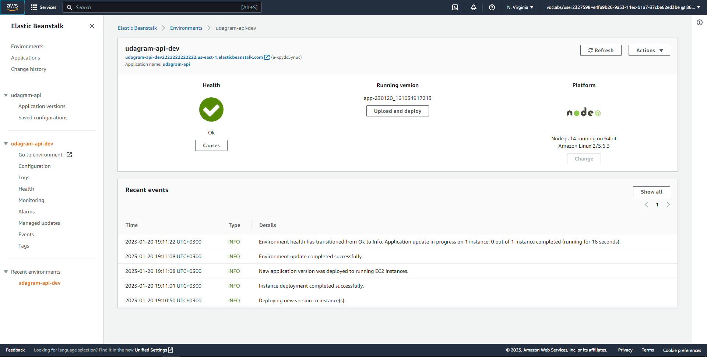
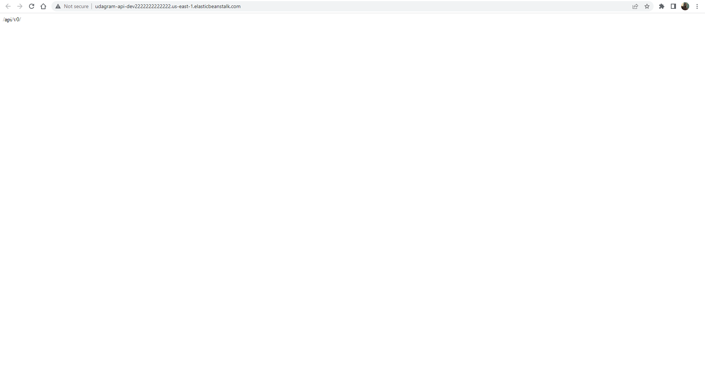
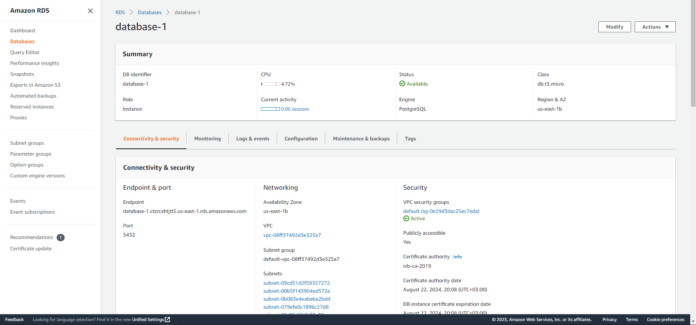
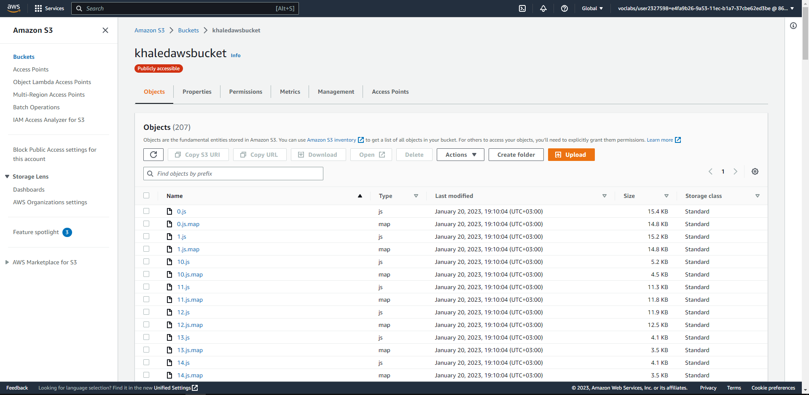
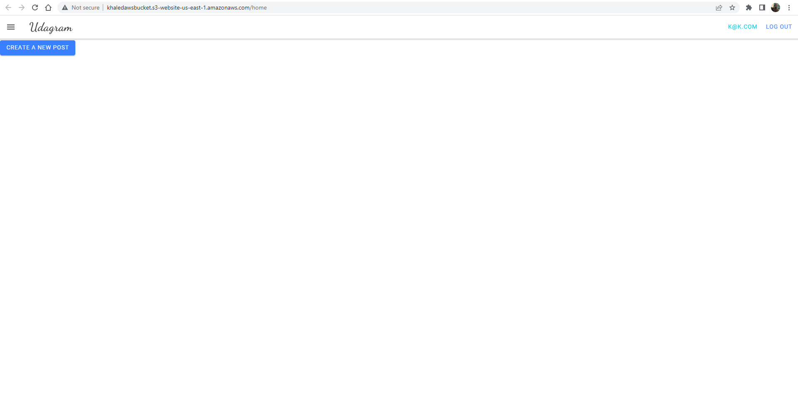

# Hosting a Full-Stack Application

## Project description

This project is part of udacity full-stack javascript ND. the code used is provided as a starter code. My task is to deploy this code in AWS and use CircleCI for the pipeline.

## Project Screenshots

### ElasticBeanstalk 

### Api

### RDS database

### S3 bucket

### Frontend

